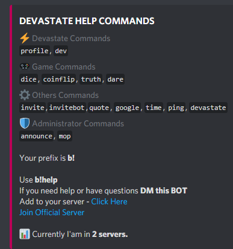

# Simple Discord Bot

   
  Just For Fun Bot 

## Setup Bot

- Python 3.6.10 or higher
- Install All requirement in requirements.txt
- Open file .token and insert your bot token (you can google it how to find this)
- Open bot.py Insert your bot.owner_id
- Run this Bot using run.bat this should make your bot online

## Built With

- [Python 3.6.10](https://www.python.org/downloads/) 
- [Discord.py 1.3.1](https://github.com/Rapptz/discord.py)

## BOT Features

- Check your discord profile information.
- Rolling dice.
- Coinflip.
- Showing truth or dare (just modify the json).
- Auto make invite link for your bot.
- Auto make invite link to join your discord server.
- Searching Images in Google, bot will return specific images from your search.
- Make announcement (you need to insert your id text channel in bot.py).
- Delete text message history.
- Check your bot ping.

## Authors

- **Felix Fernando** - _Initial work_ - [VoltGizeRz](https://github.com/voltgizerz/)

